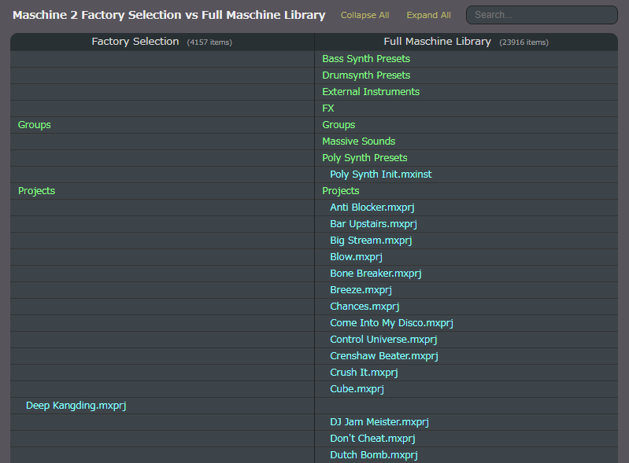

M2LibraryList
---
A script that generates a comparison chart between the Maschine 2 Full Factory Library and the Factory Selection.

## Webpage
https://aike.github.io/m2librarylist/

## Description
  
There are several types of Maschine 2 libraries.

- Factory Selection (1.6 GB)
- Full Factory Library (8 GB)
- Expansions
  
[Maschine Essentials](https://www.native-instruments.com/en/products/maschine/maschine-accessories/maschine-essentials/) is the Maschine software bundled with hardware and includes ***Factory Selection***.  
  
Maschine Essentials owners can [upgrade](https://www.native-instruments.com/en/products/maschine/maschine-accessories/upgrade-your-library/) their ***Factory Selection*** to the ***Full Factory Library*** for a fee.  
  
Expansions are additional libraries for purchase and do not contain the content of ***Full Factory Library*** / ***Factory Selection***.  
  
[KOMPLETE](https://www.native-instruments.com/en/products/komplete/bundles/komplete-14-standard/compare/) includes several Expansions, but they do not contain the content of ***Full Factory Library*** / ***Factory Selection***.  
  
There is no official content list of the libraries.
So I make a script that generates a comparison chart between the ***Full Factory Library*** and the ***Factory Selection***.

## License
M2LibraryList program is licensed under MIT License.  
Copyright 2023, aike (@aike1000)  
